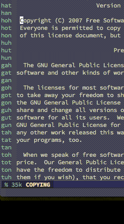

# Key-leap
## A superb way of leaping between lines



Key-leap is a minor mode for Emacs that allows you to quickly jump to any visible line in the current window. When the mode is active, it will populate the margin of the buffer's window with a set of unique keywords. 
By calling the interactive function `key-leap-start-matching` (`C-c #` by default), you can jump to any visible line by typing the keyword of that line.

The keywords are assigned to lines based on their distance from the top of the window. When scrolling through a buffer, the keys stay in the same position in the window.

Key-leap can be enabled in a buffer by calling `M-x key-leap-mode`.

## Installation

The easiest way of installing this is to clone this repositiory somewhere and tell Emacs where to find the folder containing the file `key-leap.el`.

```
$ git clone https://github.com/MartinRykfors/key-leap.git
```

Then add the following to your `init.el`:

```elisp
(add-to-list 'load-path "path/to/key-leap")
(require 'key-leap)
```

## Customization

### Key bindings
The default key sequence for the `key-leap-start-matching` command is `C-c #`. If you want a more suitable key sequence, you can create a new binding by adding the following to your config:

```elisp
(define-key key-leap-mode-map (kbd "[your keys]") 'key-leap-start-matching)
```

### Keyword generation
The variable `key-leap-key-strings` allows you to specify which characters to use in each position of the keywords. For instance, adding the following to your config
```elisp
(setq key-leap-key-chars '("htn" "ao" "ht"))
```
will make Key-leap generate and use these strings as keywords:
```
hah hat hoh hot tah tat toh tot nah nat noh not 
```

`key-leap-key-strings` should always be set to a list of strings. The first string specifies what characters to use for the first position of the keywords. The second string specifies the characters for the second positon, and so on. The keywords will be as long as the number of strings that you specify with this variable.

By default, it will generate 125 three-letter keys from the letters of the home-row of a qwerty layout.

You should use a suitably large number of different characters for Key-leap to use. The number of combinations of characters should be bigger than the number of possible visible lines for your setup, but not too much bigger than that. 

### Hooks
When calling the interactive command `key-leap-start-matching`, it will run the hooks `key-leap-before-leap-hook` and `key-leap-after-leap-hook`. To make it move the point to the first non-whitespace character of the line after leaping, add the following to your config:
```elisp
(add-hook 'key-leap-after-leap-hook 'back-to-indentation)
```

For more info on customization, please see the commentary in the file `key-leap-mode.el`, or have a look at Key-leap's customization group by calling `M-x customize-group RET key-leap`.

## Integration with evil-mode

Key-leap's way of jumping between lines can be integrated with evil-mode to be used as a motion. This allows you to compose key-leap with operators to do things like deleting every line between the point and a line with a specific key.

The integration can be enabled by adding the following to your `init.el`:

```elisp
(key-leap-create-evil-motion (kbd "<SPC>"))
```

This defines a new evil motion, `key-leap-evil-motion` bound to `<SPC>` in the `evil-motion-state-map`. If the argument to `key-leap-create-evil-motion` is left out, no key binding will be created, only the motion is defined.

This function may only be called once both evil and key-leap have been loaded.

With this setup, you can delete every line between the point and the line with key `hot` by typing `d<SPC>hot`. The motion will also work with evil's visual states, and you will be able to undo leaping by pressing ``` `` ``` for instance.

## Motivation

This mode was inspired by the `avy-goto-line` command of [avy-mode](https://github.com/abo-abo/avy). I wanted that kind of functionality but with the following differences:
* The keys should be always visible, no overlays appearing in the buffer's contents.
* There should be more control over in what sequence the characters of the keys appear.

Key-leap was the result.

## Contributing

Bug reports, suggestions and pull requests are welcome!

## Contact

Visit [@rykarn](https://twitter.com/rykarn) if you want to say hi.

## License

GPL v3
